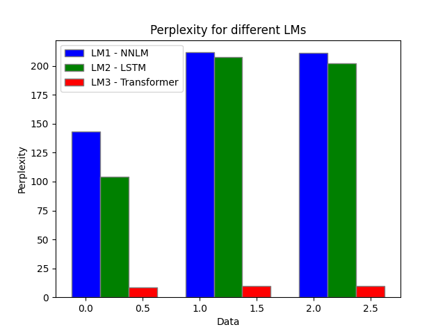

## ANLP Assignment 1

> **Name**: Bhav Beri
>
> **Roll No**: 2021111013

---

### File Structure
```
.
├── q1.py
├── q2.py
├── q3.py
├── q1_bonus.py
├── Auguste_Maquet.txt
├── perplexity.png
├── tuning_results/
│   ├── dropout.png
│   ├── hidden_dim.png
│   └── optimiser.png
├── models/
│   ├── language_model_q1.pth
│   ├── language_model_q2.pth
│   └── language_model_q3.pth
├── perplexity/
│   ├── 2021111013-LM1-test-perplexity.txt
│   ├── 2021111013-LM1-train-perplexity.txt
│   ├── 2021111013-LM1-val-perplexity.txt
│   ├── 2021111013-LM2-test-perplexity.txt
│   ├── 2021111013-LM2-train-perplexity.txt
│   ├── 2021111013-LM2-val-perplexity.txt
│   ├── 2021111013-LM3-test-perplexity.txt
│   ├── 2021111013-LM3-train-perplexity.txt
│   └── 2021111013-LM3-val-perplexity.txt
└── outputs/
    └── output_files....
```

### To run any of the files, please run the following command:

```bash
python3 <filename>.py
```

##### To run inference for any of the model, please download the model from the below given link, put it in the `models` directory, in the file change variable `train_model = False`  and then run the file.

Link: [https://iiitaphyd-my.sharepoint.com/:f:/g/personal/bhav_beri_research_iiit_ac_in/El8DwLFj2KdPsGpSwMRTzesBxBNJspzNyJ-WpMuFWvhkQw?e=54kaDs](https://iiitaphyd-my.sharepoint.com/:f:/g/personal/bhav_beri_research_iiit_ac_in/El8DwLFj2KdPsGpSwMRTzesBxBNJspzNyJ-WpMuFWvhkQw?e=54kaDs)

---

### Q1. 
Bonus file is separate from the main file. It's file name is `q1_bonus.py`. Model is trained with learning rate of `0.005` and hidden dimension size of `300`. Batch size is `64` and number of epochs are `30`. 

#### Perplexity Scores
- Train: 143.02995201102905
- Val: 211.7381600513458
- Test: 211.42966722100843

### Q1 Bonus
Same training methodolgy is used as in Q1. 

#### Hyperparameters
<!-- [{'hidden_dim': 300, 'train_perplexity': 193.2349919646906, 'val_perplexity': 394.1681275038839, 'test_perplexity': 402.88105145702735}, {'hidden_dim': 600, 'train_perplexity': 187.41871952049215, 'val_perplexity': 411.69730908937214, 'test_perplexity': 421.14196977594173}, {'hidden_dim': 1200, 'train_perplexity': 185.43435950748852, 'val_perplexity': 410.10070798956724, 'test_perplexity': 419.0763189496041}]
 -->
- Hidden Dimensions
    - 300:
        - Train: 193.2349919646906
        - Val: 394.1681275038839
        - Test: 402.88105145702735
    - 600:
        - Train: 187.41871952049215
        - Val: 411.69730908937214
        - Test: 421.14196977594173
    - 1200:
        - Train: 185.43435950748852
        - Val: 410.10070798956724
        - Test: 419.0763189496041
<!-- [{'dropout': 0.2, 'train_perplexity': 137.18518189486343, 'val_perplexity': 471.7200042068911, 'test_perplexity': 494.47556304484465}, {'dropout': 0.4, 'train_perplexity': 185.42609045742606, 'val_perplexity': 400.2443035006508, 'test_perplexity': 409.05818031693724}, {'dropout': 0.6, 'train_perplexity': 249.21001145619246, 'val_perplexity': 416.14546685231267, 'test_perplexity': 423.17144528440167}]
 -->
- Dropout
    - 0.2:
        - Train: 137.18518189486343
        - Val: 471.7200042068911
        - Test: 494.47556304484465
    - 0.4:
        - Train: 185.42609045742606
        - Val: 400.2443035006508
        - Test: 409.05818031693724
    - 0.6:
        - Train: 249.21001145619246
        - Val: 416.14546685231267
        - Test: 423.17144528440167
<!-- [{'optimiser': <class 'torch.optim.adam.Adam'>, 'train_perplexity': 187.96486475686092, 'val_perplexity': 406.04136505113905, 'test_perplexity': 419.0178772008235}, {'optimiser': <class 'torch.optim.sgd.SGD'>, 'train_perplexity': 696.5766077662701, 'val_perplexity': 700.071445266396, 'test_perplexity': 701.1974284033465}] -->
- Optimiser
    - Adam:
        - Train: 187.96486475686092
        - Val: 406.04136505113905
        - Test: 419.0178772008235
    - SGD:
        - Train: 696.5766077662701
        - Val: 700.071445266396
        - Test: 701.1974284033465

Thus, best hyperparameters are:
- Hidden Dimension: 300
- Dropout: 0.4
- Optimiser: Adam

Graphs can be found in the `tuning_results` directory.

### Q2.
Hidden dimension size is `300`, learning rate is `0.002`, batch size is `64` and number of epochs are `10`. There is a max size of the context window kept at `64` to avoid memory issues. Number of LSTM Layers used is `1` with dropout of `0.3`.

#### Perplexity Scores
- Train: 104.4500672383349
- Val: 207.9000903323066
- Test: 201.9537698778273

### Q3.
Hidden dimension size is `300`, learning rate is `0.0001`, batch size is `64` and number of epochs are `10`. There is a max size of the context window kept at `64` to avoid memory issues. Number of Decoder Layers used is `2` with dropout of `0.25`.

#### Perplexity Scores
- Train: 8.375014625931152
- Val: 9.953790048247354
- Test: 9.79198909045301

---

### Analysis
- The best performing model is the `LM3` - `Decoder-Based Transformer` model, with the lowest perplexity score. The LM1 model is the worst performing model, with the highest perplexity score.
- `LM1` model trains the slowest, with the highest perplexity score. The `LM2` model trains faster than `LM1` and has a lower perplexity score. The `LM3` model trains the fastest with a great drop in loss very quickly, with the lowest perplexity score.



----

***Note***: All models were trained on ADA with 1 2080Ti GPU, as batch jobs on gnodes 063/073/076/077. The slurm output files are in the `outputs` directory.