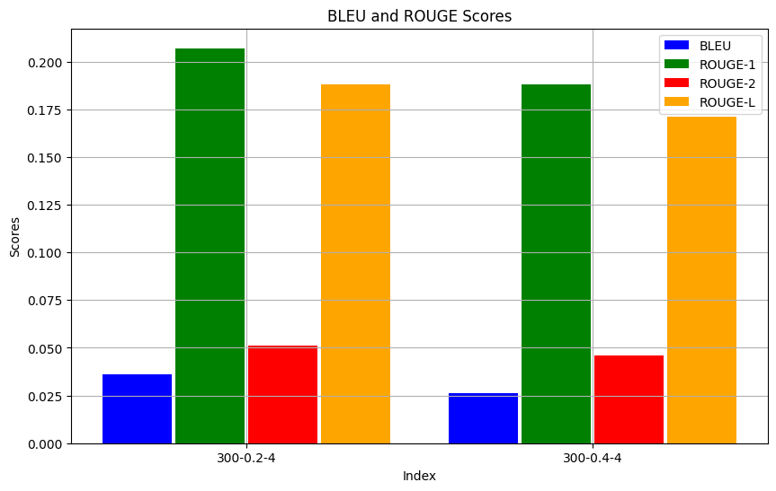

# ANLP A-3 Report

> **Name**: Bhav Beri
>
> **Roll Number**: 2021111013

----

## Theory Questions

### Q1: Self-Attention

The purpose of self-attention is to enable a model to selectively focus on different parts of a sequence when processing it, allowing the model to identify which elements are important for making predictions. This mechanism helps capture long-range dependencies within the sequence, overcoming the limitations of traditional RNNs, which struggle with distant dependencies. In self-attention, each token in the sequence attends to every other token (including itself) by computing attention weights. These weights determine the relevance of one token to another, allowing each token to gain contextual information from the entire sequence. As a result, the model can dynamically focus on the most relevant parts of the sequence for the task at hand, improving the understanding of relationships across the sequence.

### Q2: Positional Encodings

Transformers, unlike RNNs, do not have a built-in understanding of token order, as they process tokens in parallel without regard to their sequential nature. The self-attention mechanism treats all tokens equally, regardless of their position in the sequence. This lack of inherent sequence order creates a challenge when trying to model relationships between words that depend on their positions in the sequence, such as the difference between the subject and object in a sentence.

Positional encodings are introduced to provide the model with information about the relative or absolute position of tokens in a sequence, helping the model understand the structural relationships between words. This allows the Transformer to capture sequential dependencies, enabling better comprehension of word context based on token positions.

In the original Transformer architecture, positional encodings are added to word embeddings at the input stage, before applying the self-attention mechanism. After each word in the sequence is transformed into its corresponding word embedding, a positional encoding—represented as a vector of the same dimensionality as the word embedding—is added element-wise. This combined representation of the token’s semantic meaning (word embedding) and its position (positional encoding) is passed into the self-attention layers, enabling the model to retain information about token order.

**Recent Advances in Positional Encodings:**

1. **Learned Positional Encodings:** 
   Instead of using fixed sinusoidal functions, more recent models opt for learned positional encodings, where each position in the sequence has its own trainable embedding, similar to how word embeddings are trained. This allows the model to learn positional information in a data-driven manner, potentially capturing more complex positional relationships.

2. **Relative Positional Encodings:** 
   In contrast to encoding absolute positions, some models focus on encoding the relative positions between tokens. Relative positional encodings allow the model to pay attention to how far apart two tokens are, rather than their specific positions in the sequence. This is particularly useful for long sequences, where absolute positions may be less meaningful, and capturing relative distances between tokens (e.g., subject-verb-object relationships) is more crucial for understanding.

These advancements offer greater flexibility and often lead to improved performance, especially in tasks that involve long or variable-length sequences. Unlike the fixed sinusoidal approach, which assumes a rigid periodic structure, learned and relative positional encodings adapt better to the specific needs of the data and task at hand.

----

## Training Information

- Embedding Dimension: 300
- Maximum Sequence Length: 64 tokens
- Batch Size: 32
- Learning Rate: 0.0001
- Optimizer: Adam
- Number of Epochs: 15
- Loss Function: Cross-Entropy Loss
- Evaluation Metric: Cross-Entropy Loss, BLEU Score
- Number of Layers: 6
- Number of Attention Heads: 4/6
- Dropout Rate: 0.2
- Feed-Forward Dimension: 1200
- Random Seed: 42

> Note: The model scores were changing drastically from very low to very high by changing the random seed. Hence, a random seed was picked and it was fixed to ensure consistent results. It is important to note that the random seed can have a significant impact on the model's performance, especially in the case of neural networks, and thus the scores reported here may not be the best ones and not generalizable.

- Best Model was saved after each epoch based on validation loss.
- Embeddings were trained from scratch for both languages. Loading pre-trained embeddings did not yield better results, due to a lot of out-of-vocabulary words.
- Model was trained on a single Nvidia Tesla P100 GPU with 16GB memory.

-----

## Results 

(With 4 Attention Heads)
- Training Loss: 4.675078034146762
- Validation Loss: 5.429043531417847
- Test Loss: 4.843790613771398
- Over whole test set, averaged over all sentences:
    - BLEU Score: 0.03600263979329631
    - ROUGE-1 Score: 0.20661306188331552
    - ROUGE-2 Score: 0.05148773591250902
    - ROUGE-L Score: 0.18842792761946958

BLEU Score for all test sentences individually can be found in the [testbleu.txt](./results_heads4/testbleu.txt) file, while the ROUGE Scores with the individual predictions can be found in the [overall_results.json](./results_heads4/overall_results.json) file.

----

## Hyperparameter Tuning

The hyperparameters were tuned based on the following configurations:

- **Set 1**
    - **Configuration 1:**
        - Embedding Dimension: 300
        - Dropout Rate: 0.2
        - Number of Layers: 4
        - Results:
            - Training Loss: 4.675
            - Validation Loss: 5.429
            - Test Loss: 4.844
            - BLEU Score: 0.036
            - Rogue-1 Score: 0.207
    - **Configuration 2:**
        - Embedding Dimension: 300
        - Dropout Rate: 0.4
        - Number of Layers: 4
        - Results:
            - Training Loss: 4.883
            - Validation Loss: 5.678
            - Test Loss: 5.067
            - BLEU Score: 0.026
            - Rogue-1 Score: 0.188

    - **Analysis:**
        - Higher dropout rate is detrimental to the model's performance, leading to higher losses and lower BLEU scores.

    - **Graphs:**
        - Training & Validation Loss: 
        - Test Loss: 
        - Scores: 

- **Set 2**
    - **Configuration 1:**
        - Embedding Dimension: 300
        - Dropout Rate: 0.2
        - Number of Layers: 4
        - Results:
            - Training Loss: 4.675
            - Validation Loss: 5.429
            - Test Loss: 4.844
            - BLEU Score: 0.036
            - Rogue-1 Score: 0.207
    - **Configuration 2:**
        - Embedding Dimension: 600
        - Dropout Rate: 0.2
        - Number of Layers: 4
        - Results:
            - Training Loss: 4.495
            - Validation Loss: 5.589
            - Test Loss: 4.987
            - BLEU Score: 0.027
            - Rogue-1 Score: 0.201

    - **Analysis:**
        - Increasing the embedding dimension depends on the complexity of the task and the available data. In this case, a higher embedding dimension did not lead to significant improvements in performance.

    - **Graphs:**
        - Training & Validation Loss: 
        - Test Loss: 
        - Scores: 

- **Set 3**
    - **Configuration 1:**
        - Embedding Dimension: 300
        - Dropout Rate: 0.2
        - Number of Layers: 4
        - Results:
            - Training Loss: 4.675
            - Validation Loss: 5.429
            - Test Loss: 4.844
            - BLEU Score: 0.036
            - Rogue-1 Score: 0.207
    - **Configuration 2:**
        - Embedding Dimension: 300
        - Dropout Rate: 0.2
        - Number of Layers: 6
        - Results:
            - Training Loss: 4.238
            - Validation Loss: 5.456
            - Test Loss: 4.882
            - BLEU Score: 0.030
            - Rogue-1 Score: 0.204

    - **Analysis:**
        - Increasing the number of layers can enhance the model's capacity to learn complex patterns, but it also increases the risk of overfitting. In this case, adding more layers did not lead to a significant improvement in performance. Although, the training loss decreased, the validation and test losses almost remained similar.

    - **Graphs:**
        - Training & Validation Loss: 
        - Test Loss: 
        - Scores: 

Based on the hyperparameter tuning results, the best configuration was found to be the one with the following hyperparameters:
- Embedding Dimension: 300
- Dropout Rate: 0.2
- Number of Layers: 6

while keeping the other hyperparameters constant.

----

## Analysis of Model's Performance

The model's performance on the test data was evaluated using the BLEU score and ROUGE scores.\
The BLEU score of 0.036 indicates very low precision in matching words & phrases between the model's predictions and the ground truth, signaling poor word and phrase-level accuracy. While the ROUGE-1 score (0.207) shows moderate recall at the unigram level, indicating some overlap in individual words which shows model learning word-level translations, the ROUGE-2 score (0.051) reveals that the model captures very few meaningful bigram relationships, which are important for grammatical correctness and context. The ROUGE-L score (0.188) further highlights the model’s difficulty in preserving sentence structure and fluency, as it measures the longest common subsequence between the generated and reference texts. Overall, the results indicate that while some word-level content is captured, the translations lack coherence and accuracy.

The low scores suggest that either the model architecture or the data used for training may not be sufficient to capture the complexities of the translation task effectively. I think the dataset here - the quality, and the quantity of the data - played a significant role in the model's performance to decrease the BLEU score by a lot. In case of better data and quantity of around 1 million sentences, the model would have performed much better.

Also, as we can see from the training and validation losses, that the model has still not converged, and training for more epochs might lead to better results. However, due to computational constraints, the training was stopped after 15 epochs.