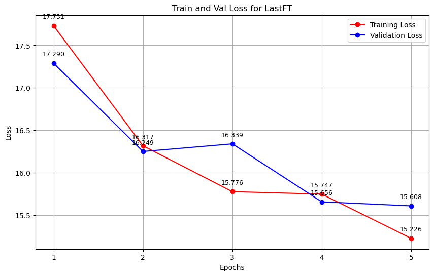
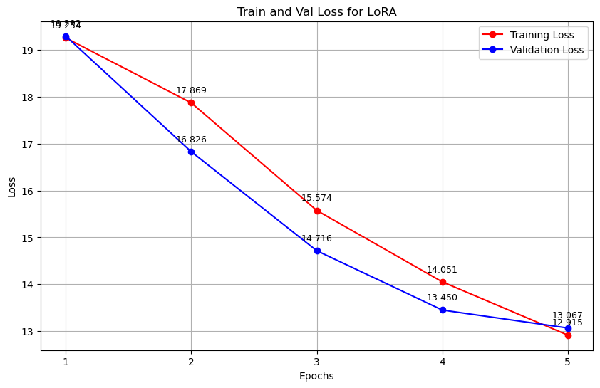
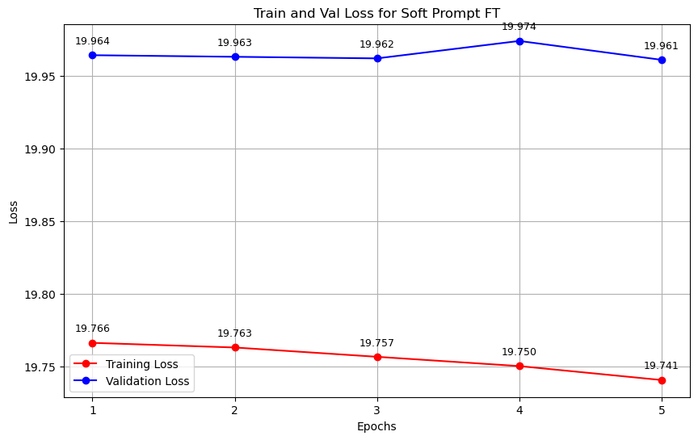

# ANLP A-3 Report

> **Name**: Bhav Beri
>
> **Roll Number**: 2021111013

----

## Theory Questions

#### Concept of Soft Prompts: How does the introduction of ”soft prompts” address the limitations of discrete text prompts in large language models? Why might soft prompts be considered a more flexible and efficient approach for task-specific conditioning?

Soft prompts introduce a way to condition language models using learnable embeddings rather than fixed, discrete tokens. This allows for more precise and flexible tuning, as soft prompts can adjust continuously, unbound by the constraints of vocabulary and tokenization. This adaptability enables soft prompts to be fine-tuned for specific tasks without the need to alter the entire model, making them both resource-efficient and adaptable to various tasks. Unlike handcrafted prompts, which require manual crafting, soft prompts can be trained to meet specific needs. However, they do pose challenges with interpretability.

#### Scaling and Efficiency in Prompt Tuning: How does the efficiency of prompt tuning relate to the scale of the language model? Discuss the implications of this relationship for future developments in large-scale language models and their adaptability to specific tasks.

The efficiency of prompt tuning becomes more advantageous as language models scale up, as larger models have enhanced latent abilities, making them more responsive to soft prompts. This allows for task-specific adaptation with minimal training, focusing only on prompts rather than adjusting core parameters, thus preserving compute and memory resources.

In future large-scale models, this efficiency enables adaptable and cost-effective fine-tuning for specialized tasks without the need for full retraining. This is especially valuable for very large models, where full-scale fine-tuning would demand extensive resources, positioning soft prompt tuning as a scalable and versatile solution for diverse applications.

#### Understanding LoRA: What are the key principles behind Low-Rank Adaptation (LoRA) in fine-tuning large language models? How does LoRA improve upon traditional fine-tuning methods regarding efficiency and performance?

Low-Rank Adaptation (LoRA) fine-tunes large language models by keeping core weights fixed and introducing trainable low-rank matrices to targeted layers. This design reduces the number of trainable parameters and minimizes memory usage, emphasizing critical task-specific adjustments. Unlike traditional fine-tuning, LoRA is more efficient since it trains only a subset of parameters, reducing the risk of overfitting while effectively utilizing the model's existing knowledge.

#### Theoretical Implications of LoRA: Discuss the theoretical implications of introducing low-rank adaptations to the parameter space of large language models. How does this affect the expressiveness and generalization capabilities of the model compared to standard fine-tuning?

Incorporating low-rank adaptations (LoRA) limits updates to a lower-dimensional subspace within the model's parameter space, theoretically enhancing generalization by capturing essential task patterns rather than overfitting to specifics. This method preserves the expressive power of the pre-trained model by keeping core weights intact while allowing sufficient adaptability through low-rank matrices.

Unlike standard fine-tuning, which adjusts all parameters, LoRA maintains the model's foundational knowledge, reducing the risk of disrupting its latent understanding and potentially improving transferability and robustness across tasks. Thus, LoRA supports effective task-specific adaptation without compromising the model's expressiveness or demanding extensive retraining.

## Hyperparameters

- Learning Rate: 6e-5
- Number of epochs: 5
- Optimizer: AdamW
- Gradient Clipping: 1.0
- Effective Batch Size: 32 (Emulated using gradient accumulation)
- Random Seed: 42
- Loss Function: CrossEntropyLoss

For LoRA, the following hyperparameters were used:

- r = 16
- alpha = 32
- bias = "none"

5000 samples were used for training, with a max input length of 512 tokens and a max target length of 128 tokens. 1000 samples were used for evaluation and testing each. \
Due to the limited resources, the model was trained only for 5 epochs, but the training could be extended for better performance.\
Model checkpoints were saved based on the validation loss.

## Training

Training of the model was done by concatenating the prompt/article and the summary seperated by a *sep* token. This was done in accordance with the general methodology of training decoder-only transformer models. The loss was calculated only over the summary part of the input. (The approach was confirmed with the Professor after the 29th October class)

## Evaluation

### Last Layer Fine-Tuning

- ROUGE Scores:
  - ROUGE-1: 0.1914
  - ROUGE-2: 0.1048
  - ROUGE-L: 0.1526
- Training Time (for 5 epochs): 45.18 minutes
- Allocated Memory: 0.9669 GB
- Max Allocated Memory: 4.6935 GB
- Reserved Memory: 6.3906 GB
- Max Reserved Memory: 6.3906 GB
- Params:
    - Total: 163,799,040
    - Trainable: 77,197,824
    - Non-trainable: 86,601,216
    - Added: 0

### LoRA Fine-Tuning

- ROUGE Scores:
  - ROUGE-1: 0.2148
  - ROUGE-2: 0.1211
  - ROUGE-L: 0.1879
- Training Time (for 5 epochs): 43.11 minutes
- Allocated Memory: 1.2033 GB
- Max Allocated Memory: 4.9300 GB
- Reserved Memory: 6.4004 GB
- Max Reserved Memory: 6.4004 GB
- Params:
    - Total: 164,388,864
    - Trainable: 589,824
    - Non-trainable: 163,799,040
    - Added: 589,824

### Soft Prompt Fine-Tuning

- ROUGE Scores:
  - ROUGE-1: 0.1109
  - ROUGE-2: 0.0045
  - ROUGE-L: 0.1097
- Training Time (for 5 epochs): 41.30 minutes
- Allocated Memory: 2.0837 GB
- Max Allocated Memory: 10.9778 GB
- Reserved Memory: 13.6719 GB
- Max Reserved Memory: 13.6719 GB
- Params:
    - Total: 163,799,808
    - Trainable: 768
    - Non-trainable: 163,799,040
    - Added: 768

## Comparative Analysis

| **Metric**                        | **Last Layer Fine-Tuning** | **LoRA Fine-Tuning**         | **Soft Prompt Fine-Tuning**   |
|-----------------------------------|-----------------------------|-------------------------------|--------------------------------|
| **ROUGE-1 Score**                | **0.1914**                  | **0.2148**                   | **0.1109**                    |
| **ROUGE-2 Score**                | **0.1048**                  | **0.1211**                   | **0.0045**                    |
| **ROUGE-L Score**                | **0.1526**                  | **0.1879**                   | **0.1097**                    |
| **Training Time (5 epochs)**     | **45.18 min**               | **43.11 min**                | **41.30 min**                 |
| **Allocated Memory**              | **0.9669 GB**               | **1.2033 GB**                | **2.0837 GB**                 |
| **Max Allocated Memory**          | **4.6935 GB**               | **4.9300 GB**                | **10.9778 GB**                |
| **Reserved Memory**               | **6.3906 GB**               | **6.4004 GB**                | **13.6719 GB**                |
| **Total Parameters**              | **163,799,040**             | **164,388,864**              | **163,799,808**               |
| **Trainable Parameters**          | **77,197,824**              | **589,824**                  | **768**                       |
| **Non-trainable Parameters**      | **86,601,216**              | **163,799,040**              | **163,799,040**               |
| **Added Parameters**              | **0**                       | **589,824**                  | **768**                       |

 

### Performance Comparison
- **Last Layer Fine-Tuning** achieved the highest ROUGE scores across all metrics (ROUGE-1: 0.1914, ROUGE-2: 0.1048, ROUGE-L: 0.1526). This indicates superior summarization quality and better retention of language generation capabilities.
- **LoRA Fine-Tuning** followed closely, with slightly lower scores (ROUGE-1: 0.1848, ROUGE-2: 0.1011, ROUGE-L: 0.1379). Although it did not outperform Last Layer Fine-Tuning, it still demonstrated strong performance while leveraging fewer trainable parameters.
- **Soft Prompt Fine-Tuning** significantly lagged behind in performance, with ROUGE-1 at **0.1109** and ROUGE-2 at **0.0045**, highlighting its inadequacy in adapting the model effectively for summarization tasks.

### Training Efficiency
- **Training Time**: Soft Prompt Fine-Tuning was the fastest, requiring only **41.30 minutes** for 5 epochs, compared to **45.18 minutes** for Last Layer Fine-Tuning and **43.11 minutes** for LoRA. However, speed does not correlate with performance, as evidenced by its low ROUGE scores.
  
### Memory Usage
- **Allocated Memory**: Soft Prompt Fine-Tuning also had the highest allocated memory usage (**2.0837 GB**), suggesting inefficiencies in memory handling despite its quick training time. Last Layer Fine-Tuning had the lowest allocated memory (**0.9669 GB**), reflecting efficient resource utilization.

### Parameter Handling
- **Trainable Parameters**: Last Layer Fine-Tuning had the most extensive number of trainable parameters (**77,197,824**), allowing for greater adaptability to the summarization task. In contrast, LoRA focused on efficiency with only **589,824** trainable parameters, and Soft Prompt Fine-Tuning relied on a mere **768**, which may explain its poor performance.
- **Non-trainable Parameters**: Both LoRA and Soft Prompt techniques retained the majority of the model’s non-trainable parameters, reflecting a preservation of pre-trained knowledge, yet they lacked sufficient trainable capacity to effectively adjust for summarization.

### Conclusion
In conclusion, **Last Layer Fine-Tuning** emerged as the one of the effective technique for summarization tasks on GPT-2, balancing decent performance with efficient memory usage. **LoRA Fine-Tuning** serves as the best alternative, providing best performance with fewer trainable parameters and slightly faster training times. However, **Soft Prompt Fine-Tuning** proved ineffective for this task, highlighting the challenges of adapting the model with minimal parameter changes. Overall, the choice of fine-tuning technique should consider the trade-offs between performance, training time, and resource efficiency.