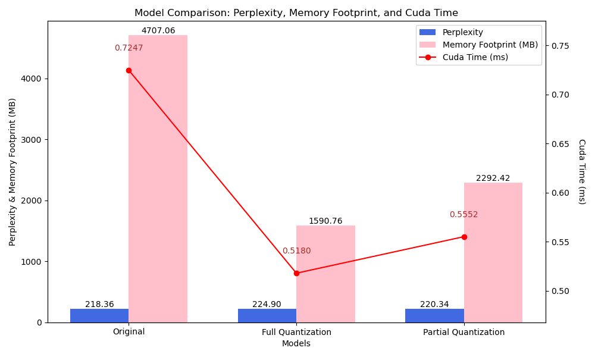
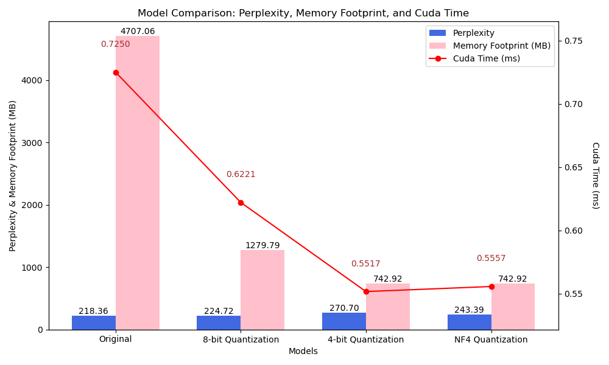

# ANLP A-4 Report

> **Name**: Bhav Beri
>
> **Roll Number**: 2021111013

----

## Dataset Used

PTB Dataset from https://www.kaggle.com/datasets/aliakay8/penn-treebank-dataset. Only test data was used for this assignment.

Number of test samples: 3761

## Model Used

`allenai/OLMo-1B-hf` from Hugging Face Transformers: https://huggingface.co/allenai/OLMo-1B-hf.

Even bigger models can be used, but due to physical constraints, this model was used.

## Metrics

- Perplexity: A measure of how well the model predicts the data. Lower values indicate better performance.
- Cuda Time: Time taken for inference on the GPU. Calculated using `torch.autograd.profiler`.
- Inference Latency: Time taken per inference. Calculated as Cuda Time divided by the number of inferences.
- Memory Footprint: Memory used by the model. Calculated using `model.get_memory_footprint()`.

## Results

### Part - 1

| Model | Perplexity | Cuda Time (ms) | Inference Latency (ms per inference) | Memory Footprint (MB) |
|-------|------------|-----------|-------------------|------------------|
| Original | 218.36021423339844 | 0.7247 | 0.0072 | 4707.06 |
| Full Quantization | 224.89942932128906 | 0.5180 | 0.0052 | 1590.76 |
| Partial Quantization | 220.3441619873047 | 0.5552 | 0.0056 | 2292.42 |



> Note: Partial Quantization was done on the first 12 layers, out of 16, of the model. These layers often handle lower-level patterns and are more tolerant to quantization. \
Later blocks are usually more sensitive as they capture higher-level abstractions, so quantizing them might lead to performance drops.

### Part - 1 Observations

1. **Perplexity**: 
   - The **Original Model** has the lowest perplexity at 218.36, indicating better accuracy.
   - **Full Quantization** results in a slight increase in perplexity to 224.90, suggesting minor accuracy loss.
   - **Partial Quantization** keeps perplexity relatively close to the original at 220.34, showing that selective quantization (on the first 12 layers) can preserve more of the model’s predictive accuracy.

2. **Cuda Time and Inference Latency**: 
   - **Full Quantization** reduces the Cuda time significantly (from 0.72 ms to 0.52 ms) and inference latency (from 0.0072 ms to 0.0052 ms), boosting processing speed.
   - **Partial Quantization** also improves speed, but it’s not as optimized as Full Quantization, likely due to some layers remaining unquantized.

3. **Memory Footprint**: 
   - **Full Quantization** shows a major memory reduction, cutting down from 4707 MB to 1590 MB.
   - **Partial Quantization** achieves a moderate decrease to 2292 MB, as expected since only part of the model is quantized.

**Summary**: Full quantization yields substantial memory savings and speed improvement at the cost of a slight perplexity increase. Partial quantization balances accuracy preservation with memory savings, offering a middle ground.

---

### Part - 2

| Model | Perplexity | Cuda Time (ms) | Inference Latency (ms per inference) | Memory Footprint (MB) |
|-------|------------|-----------|-------------------|------------------|
| Original | 218.36021423339844 | 0.7250 | 0.0072 | 4707.06 |
| 8-bit Quantization | 224.71824645996094 | 0.6221 | 0.0062 | 1279.79 |
| 4-bit Quantization | 270.70428466796875 | 0.5517 | 0.0055 | 742.92 |
| NF4 Quantization | 243.39186096191406 | 0.5557 | 0.0056 | 742.92 |



### Part - 2 Observations

1. **Perplexity**: 
   - **8-bit Quantization** maintains a low perplexity (224.71), similar to Full Quantization in Part 1, showing it retains reasonable accuracy.
   - **4-bit Quantization** shows a notable drop in accuracy, with perplexity spiking to 270.70, indicating that this aggressive quantization negatively impacts the model’s predictive quality.
   - **NF4 Quantization** also raises perplexity to 243.39, but performs better than 4-bit Quantization, suggesting it may offer an alternative when memory constraints are strict.

2. **Cuda Time and Inference Latency**:
   - **4-bit Quantization** and **NF4 Quantization** bring Cuda time and inference latency down to around 0.55 ms and 0.0055 ms, respectively, benefiting from reduced complexity in processing.
   - **8-bit Quantization** has a moderately higher Cuda time at 0.62 ms, likely due to larger data size compared to 4-bit and NF4 quantization.

3. **Memory Footprint**: 
   - **4-bit Quantization** and **NF4 Quantization** reduce the memory footprint substantially to 742 MB, making them ideal for scenarios with extreme memory constraints.
   - **8-bit Quantization** offers a balance with a footprint of 1279 MB, providing a middle ground between memory savings and model accuracy.

**Summary**: While 8-bit quantization offers a strong balance between memory usage and accuracy, more aggressive quantization (4-bit or NF4) is better suited for environments with stringent memory limits but can impact model accuracy.

---

### Overall Observations

Quantization techniques offer a range of trade-offs:

- **Full Quantization** (8-bit) offers the best balance between memory usage and model accuracy.
- **Partial Quantization** (in Part 1) provides a nuanced approach, which could be preferable for retaining lower-layer accuracy.
- **4-bit Quantization** and **NF4 Quantization** provide extreme memory savings but at a cost to perplexity, making them suitable when accuracy is a secondary concern.

## Bonus Task

The model was converted to the GGUF format using the `llama.cpp` tool. 

Command used:
```bash
python3 download.py # To download the model from huggingface

git clone https://github.com/ggerganov/llama.cpp.git # Clone the llama.cpp repository

pip install -r llama.cpp/requirements.txt

python llama.cpp/convert_hf_to_gguf.py OLMo-1B-hf --outfile OLMo-1B-hf.gguf # Convert the model to GGUF format
```


## Theory Questions

### Explain the concept of NF4 quantization and how it differs from linear quantization scales.

NF4 quantization (Normal Float 4) is a quantization method that uses a 4-bit floating-point representation, specifically designed to handle values with a wide dynamic range more efficiently than traditional linear quantization. Unlike linear quantization, which maps values uniformly across the quantization range, NF4 employs non-uniform steps that allocate more precision to smaller values and less to larger values. This is beneficial for neural network weights and activations, as smaller weights often contain critical information. NF4's non-linear scaling thus preserves model performance better than linear 4-bit quantization in many cases, achieving memory savings without heavily sacrificing accuracy.

### Discuss the impact of linear vs. nonlinear quantization on model accuracy and efficiency.

Linear quantization (e.g., standard 4-bit quantization) can significantly reduce model memory and inference time, but it often results in a higher loss in accuracy because it uniformly reduces precision across all values. In contrast, nonlinear quantization (like NF4) preserves more precision for smaller, critical values while sacrificing precision on larger ones, allowing for a better balance of accuracy and efficiency. Based on the results above, NF4 quantization maintained lower perplexity compared to linear 4-bit quantization, indicating that nonlinear approaches better retain model accuracy while still achieving substantial memory savings and speed improvements.

### Explore GGML and GGUF models, their format, and deployment benefits.

GGML (Georgi Gerganov Model Library) and GGUF (GGML Universal Format) are optimized model formats for deploying large language models (LLMs) efficiently on edge devices and limited-resource environments. GGML focuses on CPU-based quantization techniques, like 4-bit and 8-bit quantization, to reduce memory usage and boost inference speed. GGUF, an evolution of GGML, adds compatibility for a broader range of models and enhanced interoperability, making it easier to deploy across various platforms.

**Benefits**:
- **Memory Efficiency**: Both formats use quantization to minimize memory requirements, making them suitable for devices with limited RAM.
- **Cross-Platform Deployment**: GGUF extends GGML’s support, allowing seamless deployment across CPUs, GPUs, and different operating systems.
- **Speed Optimization**: By compressing model size, GGML and GGUF improve inference speed without heavily compromising accuracy, ideal for real-time applications.

